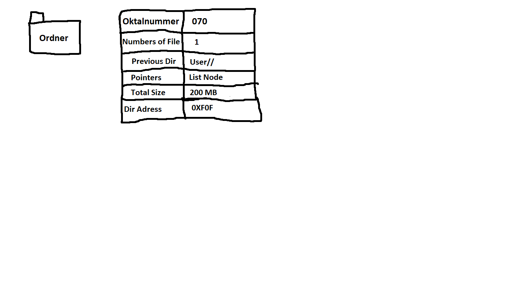

# File System Implementation Summary

### What has to be done, when creating a file foo.txt?
I would first of all, search the current directory or in which directory would I create the file. Very important is to manage the permissions of every user for this file.

When creating the file, it has to be linked to the directory, with pointers, from the start and end.
It should be possible to jump from the start to th end without iterating the whole file.
It should be also possible to jump directly from the pointer in the directory to the start or the end.
After this small Procedure I'll start to write the file on the next free block of the disk and in the first allocated block, I'll write down the permissions of the users, name and type of file and the actual file size as metadata.
If the metadata is too big for one block, I'll extend it automatically to the block where the whole data fits.

The permissions of every user, group and other, would I save in the metadata similar to the unix Systems.
The metadata would be saved in the first block of the file.
So if I need the infos like permissions of the users, file size and the location of the file, I don't have to iterate to find the infos in the file.
Because it's at the start of the file.

Unix Systems save the permissions with octal number. And in the Unix-System the octal numbers are saved in the meta-data, so if the system is checking the permissions of a file. He would compare the octal number of the metadata with the octal numbers in the system.
In order to check the octal number, the system have to save the numbers in their system.
Every octal number has it's own configuration.

### What has to be done, when the file size has to be increased? Especially take care if it needs additional blocks

You have to use the next free block and link it together with the first block.
It's similar to the nodes in a list.
The ney gree blocks are randomly found on the disk, so they have to be linked.
With linked together, I mean every block should know which address has the previous block and the next block.

### What has to be done if a file is read sequentially?
You have to start at the beginning of the file, so no matter how big the file is. You have to iterate from the beginning to the end, if you want to read the whole file.
So you have to know where you want to edit, add, delete something of the file.

### What has to be done if you want to access foo.txt randomly (seek())?
You have to search the block, you want, and read from the found block.
But in order to do that, you have to iterate from the beginning of the file and end, if you found the searched block.
I'll save the start address and the end address of the file in the directory's metadata.
So if you want to read a specific block. You will be able to read from the end or from the start.

### What has to be done when the file size decreases? Especially take care if it needs fewer blocks
I'll move all data of smaller blocks(blocks with less data then usually), to the first incomplete block. All empty blocks would be free.
In other words, I copy the data from the next Node and add it in the previous block, so that the file don't have any Memory-Gaps (Memory-Leaks).
All not used nodes will be free.

### What has to be done when a file is deleted?
The allocated space, have to be free.
Every Connection to the next block have to be dissolved.
Also the connections from the directory should be dissolved.
So if a new file is coming, you are able to use the new free space.
The content would be ignored, so it will be overwritten on the next writing of this block.

### Root-directory

Every System has a Root-Directory, so our System needs also a Root-Dir.
Our Root-Dir would be the first Directory of the system and would be owned by the root-user of the system.
The Folder-Structure would be formed like a tree.
In the Root-Dir, there should be all Directories, where the system stores all system files and all programs, which you install or the system.

### Image of our Directory- or File Implementation

NOTES
-----
The files have a Connection to the directory from the start node and the end node.
If some data between the start and end got deleted, the system would close the Memory-Gap (Memory-Leak) to free the last node if possible.
So that every small byte is ready for the next job.
The octal number for the permissions would be at the start in the metadata saved.
So you don't have to iterate the whole file, just to ask for the permissions.
